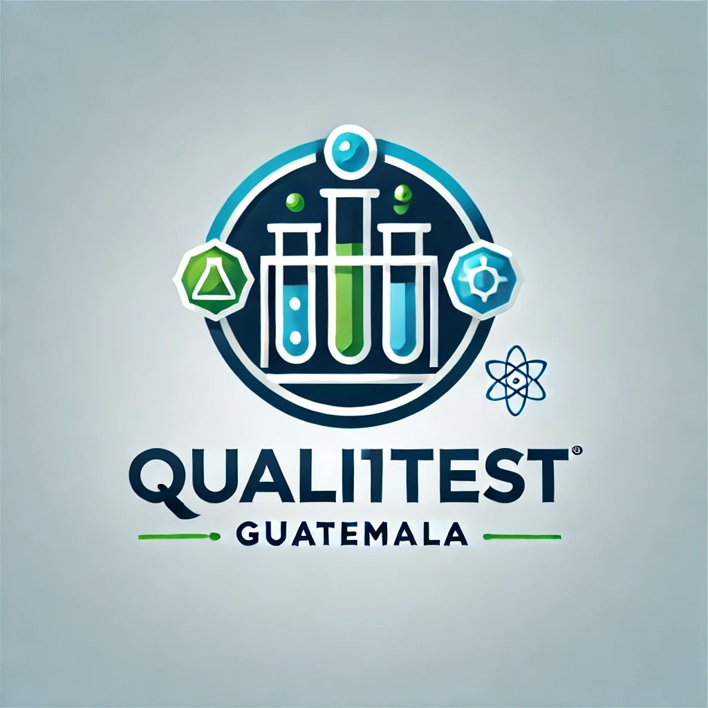

# PEEC System - Sistema de Evaluación Externa de la Calidad

Sistema web completo para el Programa de Evaluación Externa de la Calidad (PEEC) de la Asociación de Químicos Biólogos de Guatemala (AQBG).



## 📋 Descripción

El Sistema PEEC es una aplicación web full-stack que permite a los laboratorios clínicos participantes:

- Configurar parámetros de medición para cada analito
- Enviar resultados de muestras control
- Visualizar estadísticas y gráficas de desempeño
- Comparar resultados con otros laboratorios
- Obtener métricas de calidad (IDS, DRP, Z-Score)

## 🎨 Paleta de Colores

El diseño utiliza la paleta de colores del logo PEEC:

- **Navy Blue** (#1a3a52): Color primario oscuro
- **Cyan** (#00a8cc): Color secundario brillante
- **Light Cyan** (#5dc1d8): Acentos claros
- **Green** (#6ba946): Indicadores de éxito
- **Light Green** (#9bcc5f): Acentos verdes
- **Gray Blue** (#a8c5d1): Fondos sutiles

## 🚀 Tecnologías Utilizadas

### Backend
- Node.js + Express
- MySQL
- JWT para autenticación
- bcryptjs para encriptación de contraseñas

### Frontend
- React
- Material-UI (MUI)
- React Router DOM
- Recharts para visualización de datos
- Axios para peticiones HTTP

## 📁 Estructura del Proyecto

```
PEEC/
├── client/                    # Frontend React
│   ├── public/
│   │   └── logo.jpeg
│   ├── src/
│   │   ├── components/       # Componentes React
│   │   │   ├── Login.js
│   │   │   ├── Layout.js
│   │   │   ├── Dashboard.js
│   │   │   ├── Parameters.js
│   │   │   ├── ResultsEntry.js
│   │   │   └── Statistics.js
│   │   ├── context/          # Context API
│   │   │   └── AuthContext.js
│   │   ├── services/         # API services
│   │   │   └── api.js
│   │   ├── theme.js          # Tema MUI
│   │   └── App.js
│   └── package.json
├── server/                    # Backend Node.js
│   ├── config/
│   │   ├── database.js
│   │   └── schema.sql
│   ├── middleware/
│   │   └── auth.js
│   ├── routes/
│   │   ├── auth.js
│   │   ├── laboratories.js
│   │   ├── programs.js
│   │   ├── analytes.js
│   │   ├── parameters.js
│   │   ├── shipments.js
│   │   ├── results.js
│   │   └── statistics.js
│   └── index.js
├── .env.example
├── package.json
└── README.md
```

## ⚙️ Instalación y Configuración

### Prerequisitos

- **Opción A (Docker - Recomendado):**
  - Docker Desktop instalado
  - Docker Compose

- **Opción B (Manual):**
  - Node.js (v14 o superior)
  - MySQL (v8.0 o superior)
  - npm o yarn

### 🐳 Opción A: Docker (Recomendado)

La forma más rápida de empezar es usando Docker:

```bash
# 1. Iniciar todos los servicios (MySQL, Backend, Frontend)
docker-compose up -d

# 2. Ver logs
docker-compose logs -f

# 3. Acceder a la aplicación
# Frontend: http://localhost:3000
# Backend: http://localhost:5000
# Login: admin / admin123
```

¡Eso es todo! La base de datos se crea automáticamente con todos los datos iniciales.

**Comandos útiles:**
```bash
# Detener servicios
docker-compose down

# Ver logs de MySQL
docker-compose logs mysql

# Conectar a MySQL
docker exec -it peec-mysql mysql -u peec_user -ppeec_password peec_system

# Reiniciar servicios
docker-compose restart
```

Para más información detallada, ver **[DOCKER_SETUP.md](./DOCKER_SETUP.md)**

---

### 💻 Opción B: Instalación Manual

### 1. Clonar el repositorio

```bash
cd PEEC
```

### 2. Configurar la Base de Datos

1. Crear la base de datos MySQL:

```bash
mysql -u root -p < server/config/schema.sql
```

2. Configurar variables de entorno:

```bash
cp .env.example .env
```

3. Editar el archivo `.env` con sus credenciales:

```env
DB_HOST=localhost
DB_USER=root
DB_PASSWORD=tu_contraseña
DB_NAME=peec_system
DB_PORT=3306

PORT=5000
NODE_ENV=development

JWT_SECRET=tu_clave_secreta_jwt
JWT_EXPIRE=7d
```

### 3. Instalar Dependencias

#### Backend y Frontend juntos:

```bash
npm run install-all
```

#### O instalar por separado:

**Backend:**
```bash
npm install
```

**Frontend:**
```bash
cd client
npm install
```

### 4. Iniciar la Aplicación

#### Modo Desarrollo (Backend + Frontend simultáneamente):

```bash
npm run dev
```

#### O iniciar por separado:

**Backend:**
```bash
npm run server
```

**Frontend (en otra terminal):**
```bash
npm run client
```

### 5. Acceder a la Aplicación

- Frontend: http://localhost:3000
- Backend API: http://localhost:5000

## 👤 Credenciales de Prueba

**Usuario:** admin
**Contraseña:** admin123

**Código de Laboratorio:** 1010333

## 📊 Funcionalidades Principales

### 1. Configuración de Parámetros

Los laboratorios pueden configurar:
- Método/Principio de medición
- Marca de reactivos
- Instrumento utilizado
- Estándares
- Calibraciones
- Temperatura de reacción
- Longitud de onda

### 2. Envío de Resultados

- Visualización de envíos abiertos
- Ingreso de resultados por analito
- Fecha límite de envío
- Validación de datos

### 3. Estadísticas y Gráficas

#### Métricas Calculadas:
- **IDS (Índice de Desviación Estándar)**: Mide la exactitud respecto a la media del grupo
- **DRP (Desvío Relativo Porcentual)**: Desviación expresada en porcentaje
- **Z-Score**: Comparación con el valor de referencia

#### Visualizaciones:
1. **Historia de IDS**: Evolución del desempeño a lo largo del tiempo
2. **Distribución de Resultados**: Comparación con otros laboratorios
3. **Estadísticas Descriptivas**: N, Media, SD, CV%

#### Interpretación de IDS:
- **-2 a +2**: Satisfactorio ✓
- **-3 a -2 o +2 a +3**: Cuestionable ⚠️
- **Fuera de ±3**: Insatisfactorio ✗

### 4. Dashboard

- Resumen de programas activos
- Envíos pendientes
- Estado de participación
- Acceso rápido a funciones principales

## 🗃️ Base de Datos

### Tablas Principales:

- **laboratories**: Información de laboratorios
- **users**: Usuarios del sistema
- **programs**: Programas de evaluación (Bioquímica, Hematología, etc.)
- **analytes**: Analitos por programa (39 para Bioquímica)
- **methods**: Métodos/principios de medición
- **shipments**: Envíos de muestras control
- **lab_parameters**: Parámetros de medición por laboratorio
- **results**: Resultados enviados
- **statistics**: Estadísticas calculadas
- **performance_metrics**: Métricas de desempeño (IDS, DRP, Z-Score)

## 📡 API Endpoints

### Authentication
- `POST /api/auth/login` - Iniciar sesión
- `GET /api/auth/me` - Obtener usuario actual
- `POST /api/auth/change-password` - Cambiar contraseña

### Programs
- `GET /api/programs` - Listar programas
- `GET /api/programs/:id` - Obtener programa

### Analytes
- `GET /api/analytes/program/:programId` - Analitos por programa
- `GET /api/analytes/:analyteId/methods` - Métodos de un analito

### Parameters
- `GET /api/parameters` - Obtener parámetros de laboratorio
- `POST /api/parameters` - Guardar parámetros

### Shipments
- `GET /api/shipments` - Listar envíos
- `GET /api/shipments/:id` - Obtener envío

### Results
- `GET /api/results/shipment/:shipmentId` - Resultados de un envío
- `POST /api/results/shipment/:shipmentId` - Enviar resultados

### Statistics
- `GET /api/statistics/shipment/:shipmentId/analyte/:analyteId` - Estadísticas
- `GET /api/statistics/history/ids` - Historia de IDS
- `POST /api/statistics/calculate/:shipmentId` - Calcular estadísticas (Admin)

## 🔐 Seguridad

- Autenticación JWT
- Contraseñas encriptadas con bcrypt
- Middleware de autorización por roles
- Validación de entrada de datos
- Protección CORS configurada

## 🎯 Roadmap

### Fase 2 (Futuro)
- [ ] Generación automática de certificados PDF
- [ ] Notificaciones por email
- [ ] Gestión de pagos
- [ ] Panel de administración completo
- [ ] Exportación de reportes Excel
- [ ] Módulo de gestión de usuarios
- [ ] Implementación de otros programas (Hematología, Urología, etc.)
- [ ] Dashboard analítico para coordinadores

## 📞 Soporte

Para soporte técnico o consultas:

- **Email**: peec@aqbg.org
- **Teléfono**: 2448-2502
- **Sitio Web**: www.peecsystem.com

## 👥 Autores

**Asociación de Químicos Biólogos de Guatemala (AQBG)**

Coordinadores del programa PEEC:
- Bioquímica: Lic. Andrés García
- Urología: Licda. Carla Alvarado
- Parasitología: Licda. Carla Alvarado
- Bacteriología: Licda. Patricia Díaz
- Tuberculosis: Lic. Carlos Salazar
- Micología: Licda. Heidi Logeman
- Inmunología: Licda. Claudia Hernández

## 📄 Licencia

Copyright © 2025 AQBG - Asociación de Químicos Biólogos de Guatemala

---

**Versión**: 4.0
**Última actualización**: Enero 2025
